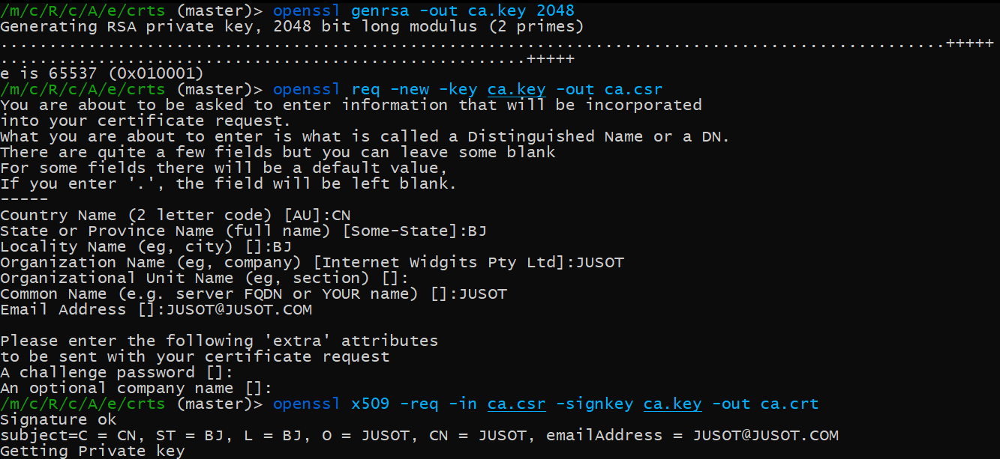
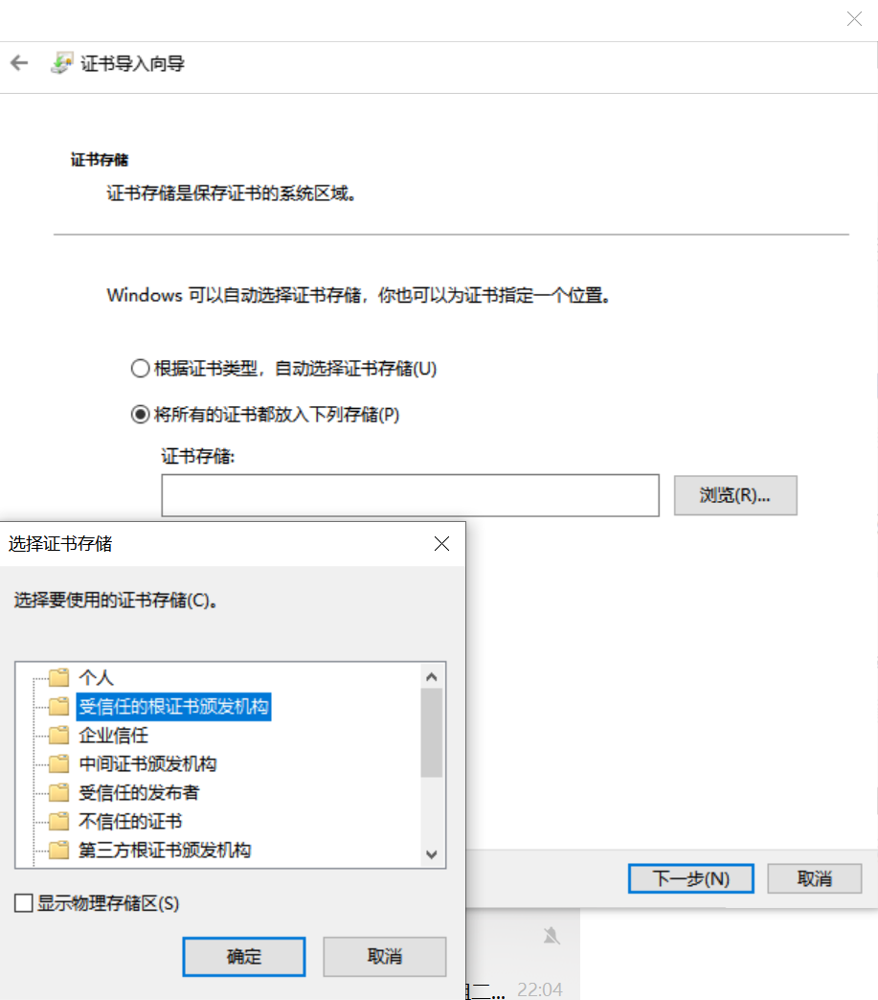
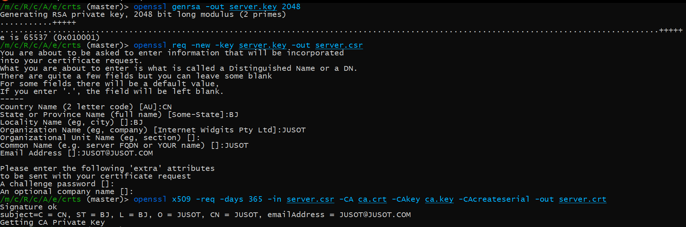
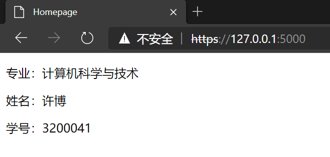
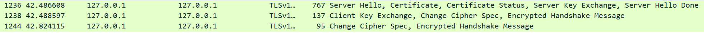
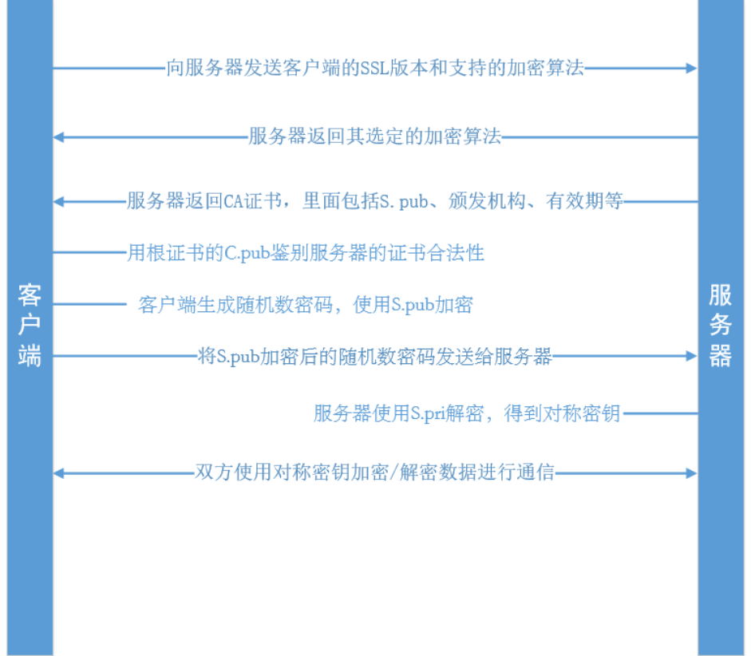

配置支持 HTTPS 访问的 Web 服务器，开启 Web 服务器的 SSL
1. 搭建 CA，并且给自己的Web服务器签发一个证书（截图）
1. 配置开启 SSL 功能的 Web 服务器
1. 通过 HTTPS 访问该 Web 服务器（截图）
1. 通过 WireShark 软件，截取访问过程（截图），建立 SSL/TLS 连接的过程，并且分析其中的步骤

### 搭建 CA，并且给自己的 Web 服务器签发一个证书（截图）

生成请求时以下信息必填：

Country Name (2 letter code) [XX]:CN

State or Province Name (full name) []:BeiJing

Locality Name (eg, city) [Default City]:BeiJing

Organization Name (eg, company) [Default Company Ltd]:Jusot

Common Name (eg, your name or your server's hostname) []: *.myhost.com

Email Address []:xxx@myhost.com

#### 搭建 CA

```bash
# 为 CA 生成一个 RSA 密钥对 ca.key
openssl genrsa -out ca.key 2048

# 生成根证书请求 ca.csr
openssl req -new -key ca.key -out ca.csr

# 为 CA 生成自签名根证书 ca.crt
openssl x509 -req -in ca.csr -signkey ca.key -out ca.crt
```

安装 CA 的根证书 ca.crt 到“受信任的根证书颁发机构”

#### 为服务器签发证书
```bash
# 为服务器生成一个 RSA 密钥对 server.key
openssl genrsa -out server.key 2048

# 生成一个证书请求 server.csr，请求对密钥对 server.key 中的公钥颁发证书
openssl req -new -key server.key -out server.csr

# 签发证书 server.crt，使用 ca.key 为请求 server.csr 签名
openssl x509 -req -days 365 -in server.csr -CA ca.crt -CAkey ca.key -CAcreateserial -out server.crt
```

#### 截图们：

##### 搭建 CA



##### 安装 CA 的根证书 ca.crt 到“受信任的根证书颁发机构”



##### 为服务器签发证书



### 配置开启 SSL 功能的 Web 服务器

使用 Flask

#### 安装 pyOpenSSL

```bash
pip3 install pyOpenSSL
```

#### 引用证书和密钥

```python
app.run(host = '0.0.0.0', port = 5000, ssl_context = ('/path/to/server.crt', '/path/to/server.key'))
```

### 通过 HTTPS 访问该 Web 服务器（截图）



### 通过 WireShark 软件，截取访问过程（截图），建立 SSL/TLS 连接的过程，并且分析其中的步骤




