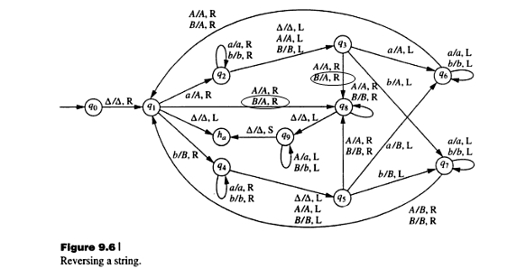

### 通用图灵机

##### 实验内容：
实现通用图灵机的程序开发，其要能够根据具有确定规范的具体图灵机和纸带，模拟具体图灵机在给定纸带的运行。具体要求如下：

1. 设计图灵机的存储方式，设计和使用恰当的数据结构存储具体图灵机（可以使用C++的STL库简化结构和操作设计）。
2. 根据下述图灵机描述规范，设计和实现从txt文档读取具体图灵机的读取函数，并根据图灵机定义做必要的检测。具体规范示例如下：
  ```
  Q: q1, q2, q3, p, p2;
  Sigma: a, b, 1, 0;
  q0: p;
  Accept: q3, q3;
  Reject: p2;
  Delta: (q2,0)->(q3,a,R),
         (q3,a)->(q1,b,L),
         ......
         (p,1)->(q2,1,-);
  ```
3. 在读入具体图灵机之后，根据下述纸带的描述规范，设计和实现从txt文档读取纸带信息的读取函数，并根据读入的图灵机，判断纸袋输入的正确性。纸带的具体规范示例如下：
  `a,b,a,a,1,1,1,0;`
4. 基于自己设计的图灵机存储结构，实现通用图灵机的运行程序。对于给定的具体图灵机和纸带，其应该能够根据具体图灵机逐步运行。在图灵机运行过程中，应逐条打出具体图灵机的运行过程。

##### 实验报告问题：
1. 你采用什么数据结构存储状态集合Q和输入符号集合Sigma的？为什么采用这种结构？
2. 你采用什么方式存储状态转移函数delta的？为什么采用这种结构？
3. 对于具体图灵机和纸带信息的读入，你做了哪些检查？为什么需要这些检查？
4. 自行编写一个字符串翻转的具体图灵机程序，给出其描述规范，使用你给出的通用图灵机程序执行该具体图灵机，并检测字符串翻转图灵机知否正确。
5. 图灵机与程序、计算机有什么差别与联系？


###### P.S.


状态图中

(q1, B) -> (q8, A, R) 应更改为 (q1, B) -> (q8, B, R)

(q5, A) -> (q8, A, R) 应更改为 (q5, A) -> (q8, B, R)